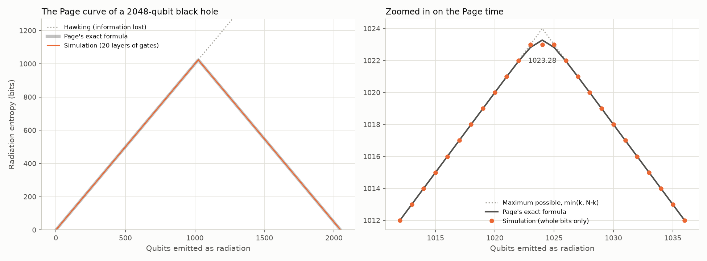

# The Page curve of a 2048-qubit toy black hole

A beginner-friendly look at the black hole information paradox. We simulate a
2048-qubit "black hole", let it evaporate one qubit at a time, and measure how
entangled the escaping radiation is with what's left. The result is the
**Page curve**: the entropy rises, peaks halfway, and falls back to zero,
which is what happens if information escapes rather than being destroyed.

The simulation is compared with Don Page's exact 1993 formula and lands on it.



## How it works

- A full quantum state of 2048 qubits would need 2^2048 (about 10^616) numbers.
  Using only **Clifford gates**, the state fits in a 2048 x 4096 table of bits
  (the Gottesman–Knill theorem), so it can be simulated exactly with
  [Stim](https://github.com/quantumlib/Stim).
- `clifford_scrambler.py` scrambles the qubits with layers of random two-qubit
  Clifford gates and measures the entanglement entropy for every split at once.
- `big_black_hole.py` runs the simulation, evaluates Page's exact formula, and
  draws the plot.

## Run it

```
python3 -m venv .venv
.venv/bin/pip install -r requirements.txt
.venv/bin/python big_black_hole.py      # ~15 seconds, -> big_black_hole.png
```
